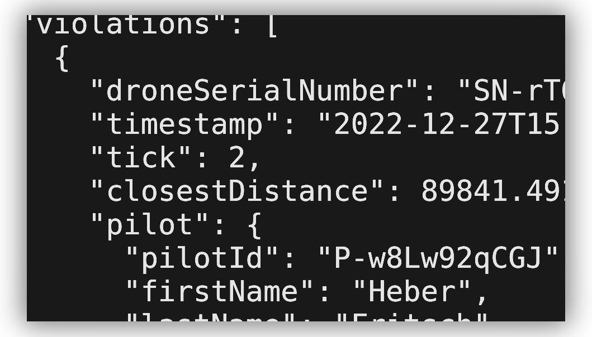

# Takapelastin

</img>

Takapelastin is the Java ☕ back-end for my solution to Reaktor's [PROJECT BIRDNEST](https://assignments.reaktor.com/birdnest/)
assignment. Java was chosen because of its excellent library support
for reading XML and JSON, which were the data formats used in the
problem statement. Additionally, I'm quite knowledgeable of Java,
so it seemed like the natural choice.

### Documentation

There's an online [Javadoc](https://bluelhf.github.io/takapelastin/) that's a good place for high-level information regarding the solution.
Still, the **best documentation is the code itself.** Maybe look around in [the project package](src/main/java/blue/lhf/takapelastin)?

### Execution
With [Java](https://adoptium.net/temurin/releases/) installed:
1. Get the .JAR file from the [latest nightly artifact](https://nightly.link/bluelhf/takapelastin/workflows/maven/main/Takapelastin.zip) or by [compiling it yourself](#compilation).
2. Run `java -jar <PATH TO .JAR FILE>`
3. Navigate to http://localhost:8002/.

### Compilation

With [Maven](https://maven.apache.org/index.html) [downloaded](https://maven.apache.org/download.cgi) and [installed](https://maven.apache.org/install.html):
1. Navigate to the project directory
2. Run `mvn clean package`
3. Get the resulting .JAR from [`target/Takapelastin.jar`](./target/Takapelastin.jar)

## Initial thoughts
1. I had a rough idea of the goals of the assignment.

   The assignment's intent was to evaluate capability to work with complex environments serving data
   in a myriad of different formats. Can the applicant model the problem effectively and create a
   coherent, high-quality solution?

2. I knew a back-end server was necessary for the solution.

   I initially thought of writing a client-side-only application, but quickly realised this was not possible.
   The client needs to know the state of drones from up to ten minutes before the user visits the website, which
   is impossible without aggregating that data beforehand and serving it from elsewhere.

3. The back-end server did not need a database.

   Since even the aggregated data was relatively short-lived (ten minutes!), and the problem statement
   mentioned that we [didn't need to handle server downtimes](https://assignments.reaktor.com/birdnest/#:~:text=Develop%20the%20application,before%20being%20evaluated.),
   we didn't really need a database to keep track of violations. Adding one would have created needless complexity, so I opted
   for in-memory aggregation instead.
## Struggles
- Modelling the problem was easy.
- Making the model consistent was hard.
  - Much of the data provided by the Reaktor API endpoints is wholly unused. For example, drone reports
    contain information about the equipment monitoring the drone (within a `<report>`), but this information
    is not needed for the solution. Currently, the back-end server completely ignores this data silently.
  - For parsing to work properly, the structure of the in-memory problem model (`blue.lhf.takapelastin.model`)
    MUST match the structure of the input data.
  - Should the structure also match for output data, even though information has been discarded, and the structure
    COULD be flattened into a simpler format?
    - I opted to flatten the output data. This can be seen in [JSONCheckerSerializer](src/main/java/blue/lhf/takapelastin/http/adapters/JSONCheckerSerializer.java):
      the serialized output flattens the nested `Report > Capture > Drones` structure into just a list of drones.
- Some parsing libraries are outdated.
  - JAXB was used to convert XML data into Java objects.
  - JAXB is old and doesn't support record classes.
  - JAXB is also very poorly documented.
  - This is why [Drone](src/main/java/blue/lhf/takapelastin/model/Drone.java) is not a record class.
  - GSON is amazing. I love GSON.
    - I wish it could marshal [Instants](https://docs.oracle.com/en/java/javase/17/docs/api/java.base/java/time/Instant.html), though.
    - I had to write [the serializer](src/main/java/blue/lhf/takapelastin/http/adapters/JSONInstantSerializer.java) myself. Stupid boilerplate :(
